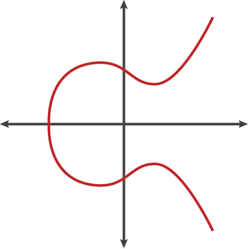
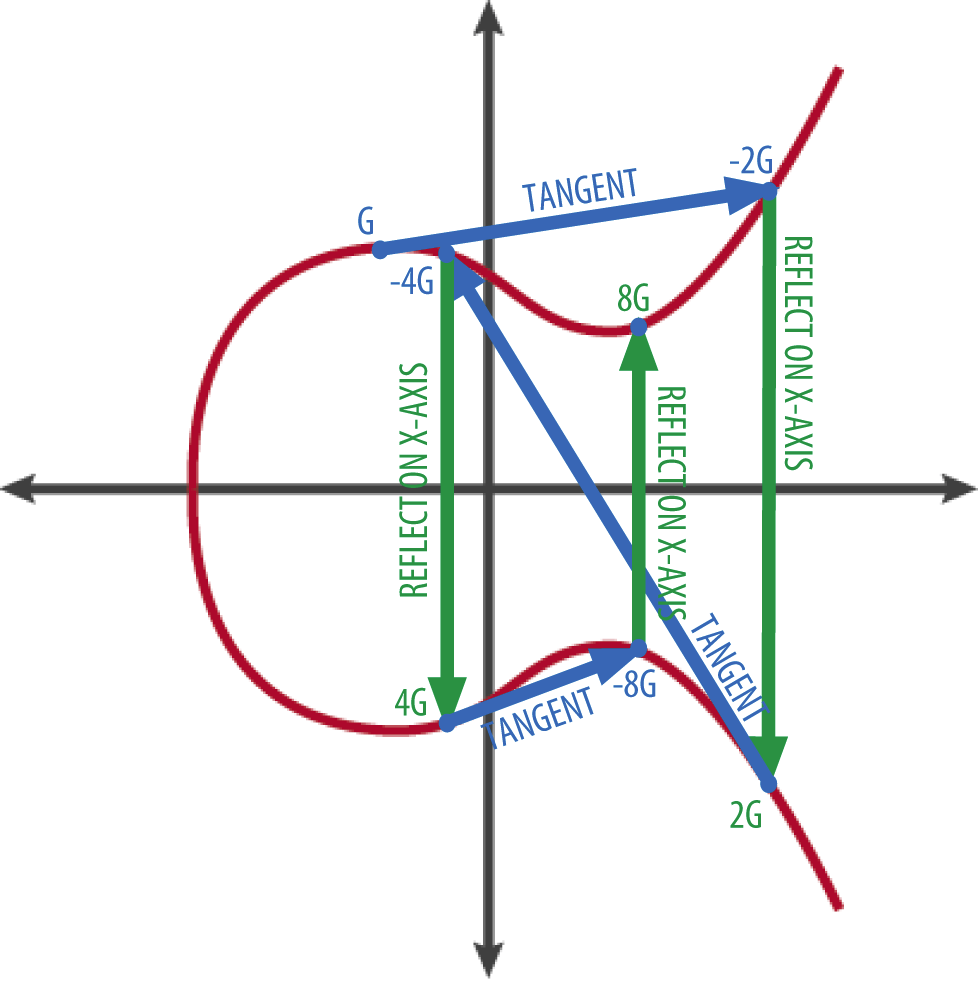

# ECDSA - Elliptic curve digital signature algorithm
## Problem
Imagine Bob wants to send a 4 BTC to Alice. 
We want two things :
- The transaction to be signed by Bob
- The transaction has not been tampered with by a malicious actor

### How can we do that?

We need to find a mathematical way to prove that Bob is the one who signed the transaction.
Only Bob can solve this problem using his private key while other parties can verify the solution using his public key.

## Solution by ECC
This problem has been solved by using ECC meaning Elliptic Curve Cryptography.

An elliptic curve is defined by the following equation: $`y^2 = x^3 + ax + b`$ and looks like this :

  

### The secp256k1 curve
In the case of Bitcoin or Ethereum, the elliptic curve is defined by the equation: $`y^2 \equiv x^3 + 7 \bmod p`$  
- where p is a prime number, defining a finite field for the curve :  $`p = 2^{256} - 2^{32} - 977`$  

We called it the secp256k1 curve.

  

A particularity of these elliptic curves is that you can add a point to itself using a geometric method:
- Take the point G on the curve
- Draw the tangent
- The intersection of the tangent and the curve is the point -2G
- Reflect it over the x-axis, the result is the point 2G

### Ok and what is the point of all that?

Imagine now I add my point G to itself x times like : $`G + G + G + ... + G = x \cdot G = P`$

$`x`$ is your private key and P is your public key.

Knowing P and G, can you find $`x`$ easily? 
The answer is no, I mean theoretically you can, but practically you can't.

Computing P is straightforward you just need to add G $`x`$ times to itself.
We can optimize the computation by using a double-and-add method: 

- Add G to itself
- Compute 2G = G + G
- Then 4G = 2G + 2G
- Then 8G = 4G + 4G

So if $`x`$ is a large number, you can compute P in a few steps.

However, the reverse is nearly impossible even with huge computing power. There's no equivalent "divide" because these points are coordinates on a 2D plane.

This is called as the discrete logarithm problem.

## ECDSA in action

Now that we understand elliptic curves, let's see how ECDSA actually works for key generation, signing and verifying messages.

### Key generation

Before we can sign anything, we need to generate our key pair:

1. **Generate private key**: Pick a random number $`x`$ where $`1 < x < n - 1 `$ (n is the curve order)
2. **Calculate public key**: Compute $`P = x × G`$ where G is the generator point
3. **Store securely**: Keep $`x`$ secret (private key), share $`P`$ publicly (public key)

#### For secp256k1
$`Gx = 55066263022277343669578718895168534326250603453777594175500187360389116729240`$  
$`Gy = 32670510020758816978083085130507043184471273380659243275938904335757337482424`$  
- It has been chosen so that scalar multiplication is fast and secure

Order $`n  ≈ 1.16 × 10^{77}`$

- The order $`n`$ is the number of points in the subgroup generated by $`G`$, the smallest $`n`$ such that $`n\cdot G = O`$  
- That ensures each private key is mapped to a unique public key.

### Signing a message

To sign a message m with your private key $x_{priv}$ :

1. **Hash the message**: Compute $`z = Hash(m)`$  
    - Bitcoin use hashSHA256 for the hash function, it's a double SHA256.
    - Ethereum use keccak256 for the hash function.
2. **Generate a random nonce**: Pick a random number $`k`$ where $`1 < k < n-1`$ (this must be unique for each signature!)
    - There are two approaches to generate this number:
      - **Random generation**: Generate a random number between $`1 < k < n-1`$
        - Critical: If k is reused or predictable, the private key can be recovered!
        - Example: Android's weak RNG in 2013 caused Bitcoin wallets to leak private keys
      - **Deterministic generation (RFC 6979)**: Calculate k deterministically from the message and private key
        - No more RNG issues
        - Example: Bitcoin/Ethereum uses this approach
        - $`k=HMAC\_SHA256(x_{priv},z)`$
3. **Calculate point**: Compute $`(x_{1}, y_{1}) = k × G`$ where G is the generator point
4. **Calculate r**: Set $`r = x_1 \bmod n`$ where $`n`$ is the curve order
5. **Calculate s the signature**: Compute $`s = k^{-1}(z + r × x_{priv}) \bmod n`$
   - **Note**: $`k^{-1}`$ is the modular inverse of k modulo n. It's the number that when multiplied by k gives 1 mod n: $`k × k^{-1} ≡ 1 \pmod{n}`$

The signature is the pair $`(r, s)`$.

### Verifying a signature

To verify signature $`(r, s)`$ on message m using public key $`P_{pub}`$:

1. **Hash the message**: Compute $`z = Hash(m)`$ 
2. **Calculate the modular inverse**: Compute $`w = s^{-1} \bmod n`$
3. **Calculate points**: 
   - $`u_{1} = z × w \bmod n`$
   - $`u_{2} = r × w \bmod n`$
4. **Verify**: Compute $`(x_{1}, y_{1}) = u_{1} × G + u_{2} × P_{pub}`$
5. **Check**: The signature is valid if $`r = x_{1} \bmod  n`$