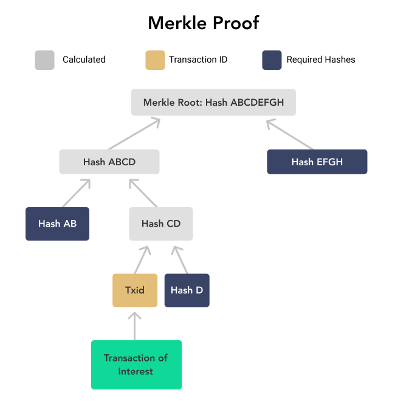

# Merkle Tree

A Merkle tree is a data structure that organizes data into a binary tree using hashes.
They were invented in 1979 by Ralph Merkle, a computer scientist, mathematician, and one of the inventors of public-key cryptography. 

## Structure
### Components
- **Leaves**: hashes of the original data
- **Internal nodes**: hash of the concatenation of their two child nodes.
- **Merkle root**: hash at the top, summarizing the entire dataset.

### Binary Tree Organization
- Data is grouped in pairs.
- Each pair of hashes → combined and hashed → parent node.
- Process repeats until only one root remains.  

### Example 

  

## Merkle Proof

### What is a Merkle Proof?
- A Merkle proof shows that a specific data is included in a Merkle tree.
- Instead of sending the entire dataset, you only provide a small set of hashes along the path from the leaf to the root.

### How it Works

  

- To prove that `Txid` is in the tree:
    - Provide `Hash C` (hash of Txid).
    - Provide its sibling `Hash D`.
    - Provide `Hash AB`
    - Provide the parent of the other branch `Hash EFGH`.
- Then you can recompute the root without all the hashes.
- If this root matches the one in the block header → proof is valid.

### Conclusion

- **Integrity**: Any change in data alters the Merkle root : guarantees tamper-evidence.
- **Efficiency**: Verifying a transaction requires only a small Merkle proof, not the entire dataset.
- **Scalability**: Enables lightweight verification for millions of transactions without full data replication.
- **Blockchain Security**:
    - Bitcoin and Ethereum use Merkle roots in block headers.
    - Light clients (SPV) can verify inclusion without storing the full blockchain.
- **Beyond Blockchain**: Also used in Git, IPFS, databases, and distributed systems to ensure consistency.

